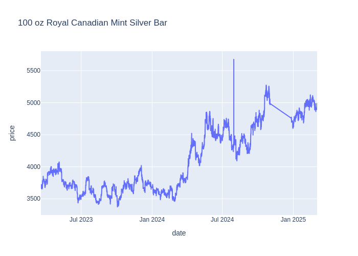
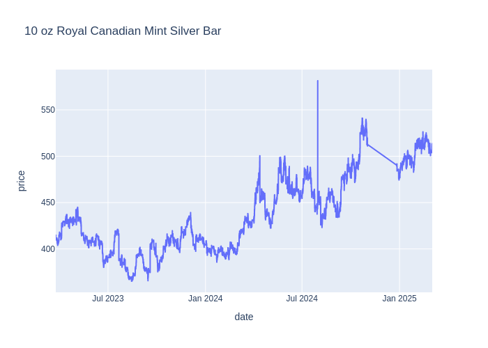
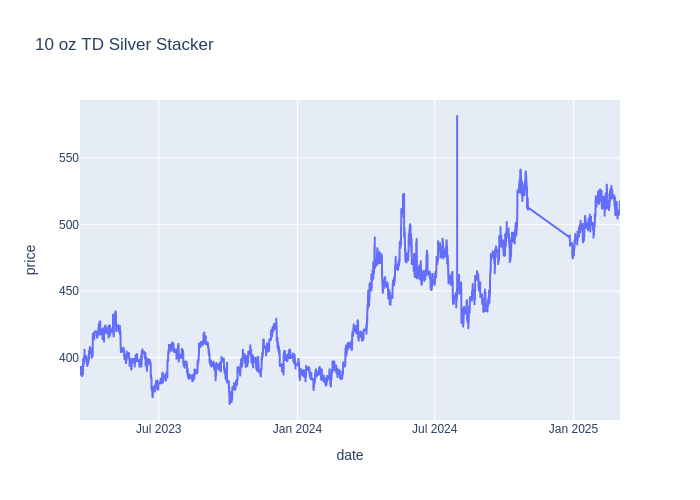

# td-precious-metal-scraper

A simple python scraper that fetches price for a few precious metals on TD's precious metal website.
This data is then output into csv files under `csv` folder. With the help of plotly, some charts are written to the repo in both static image format as well as HTML file.

